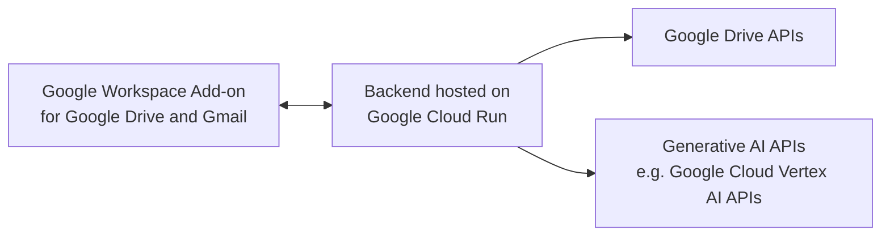

# gws-genai-addon-sample

A sample Google Workspace add-on for Google Drive and Gmail using Node.js and demonstrating how to use various Generative AI APIs.

Here is a diagram that shows the different components in this sample solution:



## Setup

### Prerequisites

- [A Google Cloud Project](https://developers.google.com/workspace/guides/create-project).
- Make sure that you turn on billing for your Cloud project. Learn how to [verify the billing status of your projects](https://cloud.google.com/billing/docs/how-to/verify-billing-enabled).
- The [Cloud SDK](https://cloud.google.com/sdk/docs/install-sdk) configured with the Cloud project. You can skip this step if using Cloud Shell.

### Setup your environment

Follows the steps in [this guide](https://developers.google.com/workspace/add-ons/quickstart/alternate-runtimes#set-environment) to setup your environment before proceeding with the next steps. 

Once completed, you can use the `gcloud` command (for example in Cloud Shell) to proceed.

### Authenticate

Run the following command and note the `ACCOUNT` value that is provided.

```sh
gcloud auth list
```

### Set active account

Set active account using the account provided in the previous step.

```sh
gcloud config set account <ACCOUNT>
```

### Set active project

Set the project ID to the project you are using.

```sh
gcloud config set project <PROJECT_ID>
```

### Enable Cloud APIs

```sh
gcloud services enable \
  appsmarket-component.googleapis.com \
  artifactregistry.googleapis.com \
  cloudbuild.googleapis.com \
  cloudresourcemanager.googleapis.com \
  drive.googleapis.com \
  gmail.googleapis.com \
  gsuiteaddons.googleapis.com \
  run.googleapis.com
```

## Deploy backend to Cloud Run

We will deploy the backend that handles requests from the add-on to Cloud Run.

### Make a local copy of the repository

For the next steps you need a local copy of the source code in this repository. 

You can either use `git clone` to [clone the repository](https://docs.github.com/en/repositories/creating-and-managing-repositories/cloning-a-repository), or [download a copy](https://docs.github.com/en/repositories/working-with-files/using-files/downloading-source-code-archives#downloading-source-code-archives-from-the-repository-view) from the repository view page.

> NOTE: Before continuing with the next step, make sure to change into the directory containing your local copy of the repository.

### Prepare configuration file

Make a copy of the `config/default-template.json` file in the `config` folder and name it `default.json`. 

This file will be used later for configuring the add-on code. You will first deploy the code with the basic template configuration, and once you retrieve the deployment URL you will configure the add-on and deploy the code again.

### Grant Cloud Build permission to deploy

```sh
PROJECT_ID=$(gcloud config list --format='value(core.project)')
PROJECT_NUMBER=$(gcloud projects describe $PROJECT_ID --format='value(projectNumber)')
gcloud projects add-iam-policy-binding $PROJECT_ID \
    --member=serviceAccount:$PROJECT_NUMBER@cloudbuild.gserviceaccount.com \
    --role=roles/run.admin
gcloud iam service-accounts add-iam-policy-binding \
    $PROJECT_NUMBER-compute@developer.gserviceaccount.com \
    --member=serviceAccount:$PROJECT_NUMBER@cloudbuild.gserviceaccount.com \
    --role=roles/iam.serviceAccountUser
```

### Start the build

```sh
gcloud builds submit
```

### Verify service is deployed

```sh
gcloud run services list --platform managed
```

Note the `URL` value in the response, as this will be your deployment URL to be used later in configuring the add-on.

## Configure the add-on backend

The configuration below should be made inside the `config/default.json` file that is deployed with the code. 

### Security

#### Service Account Email

We verify all requests that hits the endpoints are coming from the add-on. We do this by comparing the service account email in the request against the configured value in `serviceAccountEmail` under the `addOnConfig` section.

To get your service account email for the add-on, follow the steps [here](https://developers.google.com/workspace/add-ons/guides/alternate-runtimes#validate-requests-from-google) or run the following command:

```sh
gcloud workspace-add-ons get-authorization
```

#### OAuth Client ID

We verify the user ID token and extract their profile name. In order to do that, we need the OAuth client ID for the add-on.

To get the client ID, follow the steps [here](https://developers.google.com/workspace/add-ons/guides/alternate-runtimes#get_the_client_id) and then add the value to the `oauthClientId` variable in the `addOnConfig` section.

### Function URLs

Configure all the variables under `urls` in the `addOnConfig` section to point to the correct endpoints.

Update the `<DEPLOYMENT_URL>` variable with the deployment URL you retrieved when you deployed your Cloud Run service.

For example, if you deployed your code to `http://www.mydeployment.com/` then the value of `generateReplyUrl` will be `https://www.mydeployment.com/generateReplyUrl`

These function URLs are used for interactions between cards in the add-on.

### GenAI Providers

This add-on can be used with the list of providers below. For each provider, you can configure the `enabled` flag to show in the add-on, and any applicable configuration (i.e. API key) for that provider.

Make sure to set the `defaultProvider` variable to an enabled provider that you want to be selected by default.

#### Google Cloud Vertex AI Gemini API

The add-on can use [Google Cloud Vertex AI Gemini API](https://cloud.google.com/vertex-ai/docs/generative-ai/learn/overview#gemini-api) to generate and summarize text.

To use this provider, you first need to enable the service in your Google Cloud project.

```sh
gcloud services enable aiplatform.googleapis.com
```

The code uses the service account attached to the Cloud Run deployment to generate access tokens to use the Vertex AI Gemini API. This service account by default is the  the [default Comptue Engine service account](https://cloud.google.com/compute/docs/access/service-accounts#default_service_account).

You need to grant this service account the following role in order to access the Vertex AI APIs:

`Vertex AI User (roles/aiplatform.user)`

You can either do this via the [Google Cloud Console](https://cloud.google.com/iam/docs/grant-role-console), or by using the following command (make sure to update `PROJECT_NUMBER` and `PROJECT_ID` with the relevant values for your project):

```sh
gcloud projects add-iam-policy-binding PROJECT_ID \
      --member='serviceAccount:PROJECT_NUMBER-compute@developer.gserviceaccount.com' \
      --role='roles/aiplatform.user'
```
> Learn more on service account best practices and other ways to authenticate  [here](https://cloud.google.com/iam/docs/best-practices-service-accounts). 

You should configure the following parameters in the relevant section for `vertexGeminiProTextApi` in the add-on configuration file:

- `project`: The Google Cloud project ID where the add-on code will run.
- `region`: The region used for the Gemini API  (default is `us-central1`). Make sure the value corresponds to one of the [available regions for Gemini API](https://cloud.google.com/vertex-ai/docs/generative-ai/model-reference/gemini#http_request).

Additional provider configurations are available in the `modules/gen_ai_providers/vertex_ai_gemini_pro_text_api.js` file, including the model used, maximum tokens returned, and other configuration.

##### Terms of Use & Privacy Policy

> Vertex AI Gemini API is a Preview offering, subject to the "Pre-GA Offerings Terms" in the General Service Terms section of the [Service Specific Terms](https://cloud.google.com/terms/service-terms). Pre-GA products and features are available "as is" and might have limited support, and changes to pre-GA products and features may not be compatible with other pre-GA versions. For more information, see the [launch stage descriptions](https://cloud.google.com/products#product-launch-stages). Further, by using Vertex AI Gemini API, you agree to the [Additional Terms](https://cloud.google.com/trustedtester/aitos) for Generative AI Preview Products.

Check Google Cloud's [Terms](https://cloud.google.com/product-terms#section-3) for more information on how your data is processed.

#### Google Cloud Vertex AI PaLM API

The add-on can use [Google Cloud Vertex AI PaLM API](https://cloud.google.com/vertex-ai/docs/generative-ai/learn/overview#palm-api) to generate and summarize text. 

To use this provider, you first need to enable the service in your Google Cloud project.

```sh
gcloud services enable aiplatform.googleapis.com
```

The code uses the service account attached to the Cloud Run deployment to generate access tokens to use the Vertex AI PaLM APIs. This service account by default is the [default Comptue Engine service account](https://cloud.google.com/compute/docs/access/service-accounts#default_service_account).

You need to grant this service account the following role in order to access the Vertex AI APIs:

`Vertex AI User (roles/aiplatform.user)`

You can either do this via the [Google Cloud Console](https://cloud.google.com/iam/docs/grant-role-console), or by using the following command (make sure to update `PROJECT_NUMBER` and `PROJECT_ID` with the relevant values for your project):

```sh
gcloud projects add-iam-policy-binding PROJECT_ID \
      --member='serviceAccount:PROJECT_NUMBER-compute@developer.gserviceaccount.com' \
      --role='roles/aiplatform.user'
```
> Learn more on service account best practices and other ways to authenticate  [here](https://cloud.google.com/iam/docs/best-practices-service-accounts). 

You can configure the region for the API in the `region` parameter (default is `us-central1`) in the relevant section for `vertexAiPalmApi` in the add-on configuration file. Please make sure the value you select corresponds to one of the Vertex AI service endpoint listed [here](https://cloud.google.com/vertex-ai/docs/reference/rest#service-endpoint).

Additional configurations for the provider are found in the `modules/gen_ai_providers/vertex_ai_palm_api.js` file, including the models used, maximum tokens returned, and other configuration.

##### Terms of Use & Privacy Policy

Please check Google Cloud's [Terms](https://cloud.google.com/product-terms#section-3) for more information on how your data is processed.

#### Google AI Gemini API

The add-on can use [Google AI Gemini API](https://ai.google.dev/docs/gemini_api_overview) to generate and summarize text.

> Check the list of [available languages and regions for Google AI Studio and Gemini API](https://ai.google.dev/available_regions) to confirm that Gemini API is available in your region before you continue with the next step.

To use this provider, you need to [create an API key in Google AI Studio](https://makersuite.google.com/) and save it in the `apiKey` parameter in the relevant section for `geminiApi` in the add-on configuration file. Additional configurations for the provider are found in the `modules/gen_ai_providers/gemini_api.js` file, including the model used, maximum tokens returned, and other configuration.

##### Terms of Use & Privacy Policy

> The Gemini API is currently in public preview. Production applications are not supported yet. 

Please check Google's [Terms of Use](https://policies.google.com/terms), [Privacy Policy](https://policies.google.com/privacy) for more information on how your data is processed.

#### Cohere.ai

The add-on can also use [Cohere.ai](https://www.cohere.ai). To setup this provider, login to your Cohere.ai account and generate an API key, then you can save it in the `apiKey` parameter in the add-on configuration file.

Please note that we use the specialized summarization endpoint for the sumamrization feature.

Additional configurations for the provider are found in the `modules/gen_ai_providers/cohere.js` file, including the models used, maximum tokens returned, and other configuration.

##### Terms of Use & Privacy Policy

Please check Cohere.ai's [Terms of Use](https://cohere.com/terms-of-use), [Privacy Policy](https://cohere.com/privacy) and [Data Usage Policy](https://cohere.com/data-usage-policy) for more information on how your data is processed.

### Redeploy the code

Once you have finished configuring the code, you must redeploy the Cloud Run service again.

To do so, run the following command:

You will have to redeploy your code once you've made the changes to the file using the following command:

```sh
gcloud builds submit
```

Once the service is deployed, you can use the add-on.

## Register the Google Workspace Add-on

### Prepare the deployment descriptor

Make a copy of the `sample_deployment_file/deployment.json` in the main directory, and then edit the file to replace
the `<DEPLOYMENT_URL>` variables with the deployment URL for the Cloud Run service above.

### Upload the deployment descriptor

```sh
gcloud workspace-add-ons deployments create genai-gmail-companion --deployment-file=deployment.json
```

### Authorize access to the add-on backend

```sh
SERVICE_ACCOUNT_EMAIL=$(gcloud workspace-add-ons get-authorization --format="value(serviceAccountEmail)")

gcloud run services add-iam-policy-binding \
    genai-gmail-companion \
    --member=serviceAccount:$SERVICE_ACCOUNT_EMAIL \
    --role=roles/run.invoker \
    --region=us-west1 \
    --platform=managed
```

### Install the add-on

```sh
gcloud workspace-add-ons deployments install genai-gmail-companion
```

### To replace deployment.json

If you later make any changes to the deployment descriptor `deployment.json` file (i.e. update logo, name of the add-on, supported integrations), use the following command to update the add-on:

```sh
gcloud workspace-add-ons deployments replace genai-gmail-companion --deployment-file=deployment.json
```
